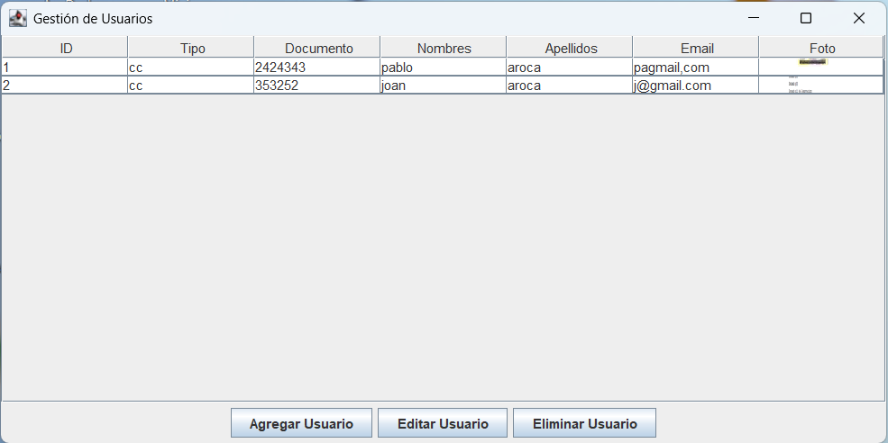

# Sistema de Gestión de Usuarios

Aplicación de escritorio desarrollada en **Java (Swing)** que permite administrar usuarios con almacenamiento en base de datos **MySQL**, incluyendo fotografía de cada usuario.

---

## 📌 Descripción

El **Sistema de Gestión de Usuarios** es una aplicación que permite registrar, consultar, actualizar y eliminar usuarios dentro de una base de datos.  
Además, cada usuario puede tener asociada una **fotografía**, lo que facilita su identificación dentro del sistema.

La aplicación cuenta con una interfaz gráfica desarrollada con **Java Swing**, permitiendo una interacción sencilla e intuitiva para el usuario.

---

## 🎯 Objetivo

Desarrollar una aplicación de escritorio que permita la **gestión eficiente de usuarios**, integrando:

- Interfaz gráfica amigable
- Conexión con base de datos
- Almacenamiento de fotografías
- Operaciones CRUD completas

---

## ⚙️ Tecnologías utilizadas

- **Java** – Lenguaje de programación principal
- **Java Swing** – Desarrollo de la interfaz gráfica
- **MySQL** – Base de datos
- **JDBC** – Conexión entre Java y MySQL
- **IntelliJ** – Entorno de desarrollo
- **Patrón DAO** 

---

## ✨ Funcionalidades

El sistema permite realizar las siguientes operaciones:

- ➕ **Registrar usuarios**
- 🔍 **Consultar usuarios**
- ✏️ **Actualizar información**
- ❌ **Eliminar usuarios**
- 📷 **Agregar fotografía al usuario**
- 📋 **Visualizar lista de usuarios registrados**

---
## 🛠 Tecnologías Utilizadas

- Java 17+
- Java Swing
- MySQL
- JDBC
- Patrón DAO

---

# ⚙ Configuración del Proyecto

## 1️⃣ Crear Base de Datos MySQL
CREATE DATABASE gestion_usuarios;

USE gestion_usuarios;

CREATE TABLE usuarios (
id INT AUTO_INCREMENT PRIMARY KEY,
tipo_documento VARCHAR(50),
documento VARCHAR(50),
nombres VARCHAR(100),
apellidos VARCHAR(100),
email VARCHAR(100),
foto LONGBLOB
);

## 2️⃣ Configurar conexión a base de datos

Ruta: **src/util/ConexionDB.java**

## 👨‍💻 Autor

Pablo Andres Aroca Garcia